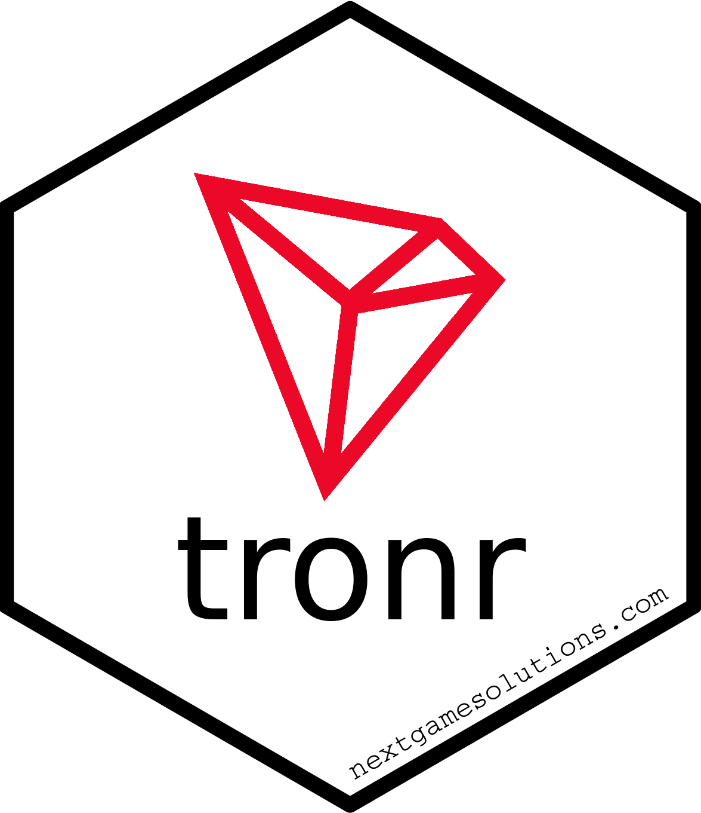
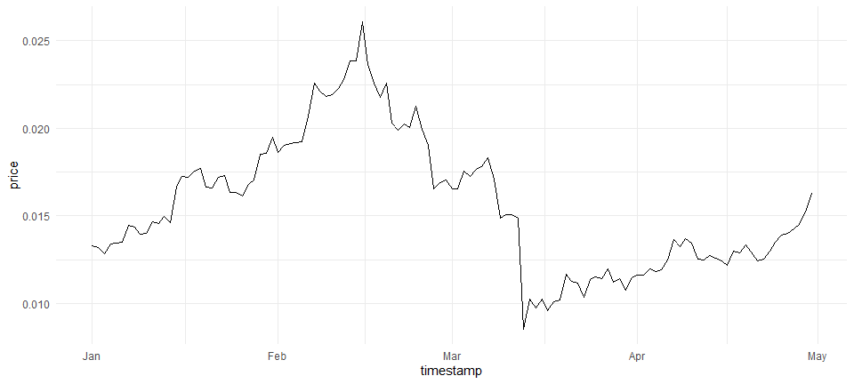

<!-- README.md is generated from README.Rmd. Please edit that file -->

# tronr <a href='https://github.com/next-game-solutions/tronr/'></a>

<!-- badges: start -->

[](https://github.com/next-game-solutions/tronr/actions/workflows/r.yml)
[](https://codecov.io/gh/next-game-solutions/tronr)
[](https://lifecycle.r-lib.org/articles/stages.html#experimental)
<!-- badges: end -->

`tronr` is a toolbox to explore the [TRON
blockchain](https://tron.network/index?lng=en). This R package allows
one to collect data on the blockchain’s accounts, transactions, token
transfers, and smart contract events. In addition, users can query the
current and historical market status of [Tronix
(TRX)](https://tron.network/trx?lng=en), the native currency of TRON.

## Installation

At the moment, `tronr` is only available on GitHub and can be installed
with:

``` r
# install.packages("devtools")
devtools::install_github("next-game-solutions/tronr")
```

A [CRAN](https://cran.r-project.org/) version of the package is planned
for release in the near future.

## Examples

Detailed examples of the `tronr` usage can be found in the online
documentation. Illustrated below are just a few common queries:

``` r
library(tronr)
library(dplyr)
library(ggplot2)

# Current price of TRX expressed in USD, EUR and BTC (Bitcoin):
get_current_trx_price(vs_currencies = c("usd", "eur", "btc"))
#> # A tibble: 3 x 3
#>    trx_price vs_currency last_updated_at    
#>        <dbl> <chr>       <dttm>             
#> 1 0.0604     usd         2021-02-21 12:35:43
#> 2 0.0498     eur         2021-02-21 12:35:43
#> 3 0.00000105 btc         2021-02-21 12:35:43


# Querying the TRX market data for a historical period, and plotting the 
# evolution of price:
(min_timestamp <- as.POSIXct("2020-01-01 00:00:00") %>% to_unix_timestamp())
#> [1] "1577836800000"
(max_timestamp = as.POSIXct("2020-05-01 00:00:00") %>% to_unix_timestamp())
#> [1] "1588287600000"

price_history <- get_trx_market_data_for_time_range(
  vs_currency = "usd",
  min_timestamp = min_timestamp,
  max_timestamp = max_timestamp
)

glimpse(price_history)
#> Rows: 121
#> Columns: 5
#> $ timestamp         <dttm> 2020-01-01, 2020-01-02, 2020-01-03, 2020-01-04, ...
#> $ vs_currency       <chr> "usd", "usd", "usd", "usd", "usd", "usd", "usd", ...
#> $ price             <dbl> 0.01329452, 0.01319943, 0.01284472, 0.01337084, 0...
#> $ total_trading_vol <dbl> 1134528759, 1032624901, 1056549454, 1168793811, 1...
#> $ market_cap        <dbl> 877119319, 872350811, 848482045, 885589788, 88832...

price_history %>% 
  ggplot(aes(timestamp, price)) +
  geom_line() +
  theme_minimal()
```



``` r

# Information on the latest block on the chain:
get_block_info(latest = TRUE) %>% 
  glimpse()
#> Rows: 1
#> Columns: 11
#> $ request_time    <dttm> 2021-02-21 12:39:39
#> $ block_number    <chr> "27841015"
#> $ timestamp       <dttm> 2021-02-21 12:38:33
#> $ hash            <chr> "0000000001a8d1f7d93d7e4bc40889b1ae1fd328d1b671c8a4...
#> $ parent_hash     <chr> "0000000001a8d1f69291287299ab41d7d18be0a1d72759b3ed...
#> $ tx_trie_root    <chr> "2q8j1sQad2sVwMpViH2b2m55tNvamXmLsDeX6p5prUfLxFigRE"
#> $ confirmed       <lgl> TRUE
#> $ size            <int> 32623
#> $ witness_address <chr> "TWvncFqyDfMcKfjsx4hvoWwhJfF5yKMZcU"
#> $ tx_count        <int> 125
#> $ tx              <list> [<tbl_df[125 x 4]>]


# Current balance of an account:
get_account_balance("TQjaZ9FD473QBTdUzMLmSyoGB6Yz1CGpux") %>% 
  glimpse()
#> Rows: 1
#> Columns: 10
#> $ request_time <dttm> 2021-02-21 12:39:41
#> $ address      <chr> "TQjaZ9FD473QBTdUzMLmSyoGB6Yz1CGpux"
#> $ name         <chr> "SunTRXV3Pool"
#> $ total_tx     <int> 69011
#> $ bandwidth    <list> [<tbl_df[1 x 20]>]
#> $ trx_balance  <dbl> 5901098
#> $ n_trc20      <int> 16
#> $ trc20        <list> [<tbl_df[16 x 7]>]
#> $ n_trc10      <int> 12
#> $ trc10        <list> [<tbl_df[12 x 8]>]


# TRC-10 asset transfers to / from an account within a time range:
get_trc10_transfers(
  related_address = "TMaBqmMRekKZMQEq3u3QrJpGDwPYZZo87V",
  min_timestamp = "1577837400000",
  max_timestamp = "1577837430000"
) %>% glimpse()
#> Rows: 2
#> Columns: 13
#> $ tx_id                    <chr> "675a3606a414f0ea09979688889df0237911d368d...
#> $ block_number             <chr> "15860788", "15860784"
#> $ timestamp                <dttm> 2020-01-01 00:10:27, 2020-01-01 00:10:15
#> $ from_address             <chr> "TMaBqmMRekKZMQEq3u3QrJpGDwPYZZo87V", "TMa...
#> $ to_address               <chr> "TT5W8MPbYJih9R586kTszb4LoybzyUSkbq", "TBh...
#> $ is_contract_from_address <lgl> FALSE, FALSE
#> $ is_contract_to_address   <lgl> FALSE, FALSE
#> $ contract_result          <chr> "SUCCESS", "SUCCESS"
#> $ confirmed                <lgl> TRUE, TRUE
#> $ amount                   <dbl> 10, 10
#> $ token_id                 <chr> "1002830", "1002830"
#> $ token_name               <chr> "AUP", "AUP"
#> $ token_abbr               <chr> "AUP", "AUP"
```

## Things to keep in mind when using `tronr`

The design of this package is rather opinionated, which among other
aspects means the following:

1.  Under the hood, most of the transaction-related data are queried in
    `tronr` via a public API that powers the [Tronscan
    website](https://tronscan.org/). This has a few important
    implications:
    -   The [Tronscan
        API](https://github.com/tronscan/tronscan-frontend/blob/master/document/api.md "Tronscan API")
        is considerably slower than the [TronGrid
        API](https://www.trongrid.io/), which is the recommended tool
        for use cases that require a computationally efficient and
        robust mechanism to extract large amounts of data from the TRON
        blockchain. However, the Tronscan API was chosen due to the
        richer and more schema-consistent data it returns. As the
        TronGrid API matures, our decision to use the Tronscan API in
        `tronr` may change in the future.
    -   Attempts to perform frequent and/or “heavy” queries from the
        same IP address using `tronr` may be treated by the Tronscan
        servers as [denial-of-service
        attacks](https://www.cloudflare.com/en-gb/learning/ddos/glossary/denial-of-service/)
        and lead to black-listing of that IP address. Users of `tronr`
        are thus kindly asked to be considerate and implement the
        respective safeguards in their code (e.g., breaking the queries
        into smaller chunks, with pauses in between).
    -   As a result of the previous two points, `tronr` is *not*
        intended for development of high-load analytical application.
2.  Many of the `tronr` functions return data in the form of [nested
    tibbles](https://tidyr.tidyverse.org/articles/nest.html) (see
    examples above). Arguably, this is a natural choice for such data,
    given their hierarchical structure. Nested tibbles were chosen also
    because they represent a “tidy” data format compatible with the
    [`tidyverse`](https://www.tidyverse.org/ "tidyverse") toolkit (in
    particular, the [`tidyr`](https://tidyr.tidyverse.org/ "tidyr")
    package). Admittedly, though, not all R users prefer working with
    the `tidyverse` tools and this makes `tronr` somewhat less
    accessible and attractive for such users.

## Getting help

If you encounter a clear bug, please file an issue with a minimal
reproducible example on
[GitHub](https://github.com/next-game-solutions/tronr/issues).

## License

This package is licensed to you under the terms of the MIT License.

The TRON logo used in the package’s hexagon sticker is property of the
[TRON Foundation](https://tron.network/).

Copyright (c) 2021 [Next Game Solutions
OÜ](http://nextgamesolutions.com)

------------------------------------------------------------------------

Please note that this project is released with a [Contributor Code of
Conduct](https://www.contributor-covenant.org/version/1/0/0/code-of-conduct/).
By participating in this project you agree to abide by its terms.
